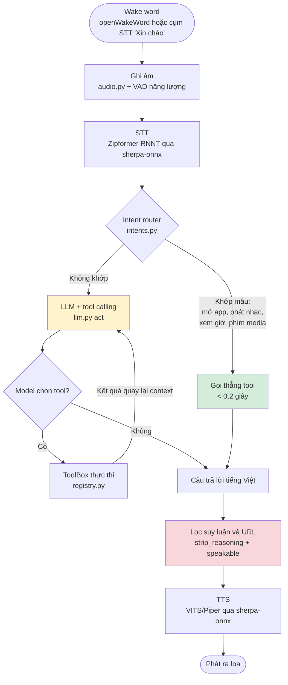
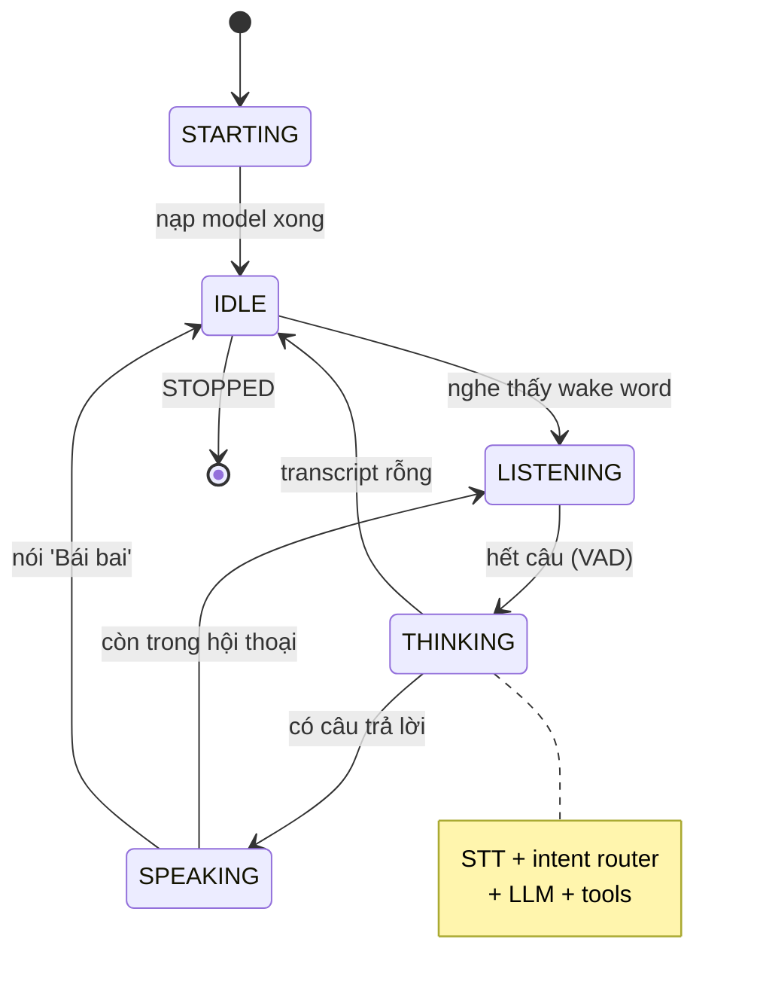
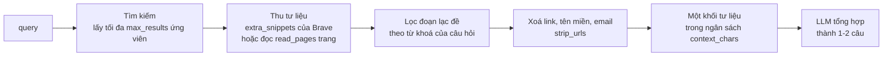

# Jarvis — trợ lý giọng nói tiếng Việt chạy local trên Windows

Jarvis là trợ lý giọng nói local-first cho Windows: nói câu đánh thức → nhận dạng tiếng Việt → LLM chạy trong LM Studio → trả lời bằng giọng nói. Mọi xử lý chính đều chạy trên máy: không có cloud fallback, không gửi audio hay transcript đi đâu.

Ranh giới mạng duy nhất là web search và phát nhạc YouTube. Audio, transcript và suy luận của model không bao giờ rời khỏi máy. Web search mặc định dùng [Brave Search API](https://brave.com/search/api/) (free tier), và vẫn có ba backend không cần key để chọn thay.

## Luồng hoạt động



Trạng thái được `state.py` quản lý và tray icon phản chiếu:



## Cấu trúc mã nguồn

```
jarvis/
├── __main__.py        # python -m jarvis
├── cli.py             # 13 subcommand, mỗi cái tự nạp module cần dùng
├── config.py          # schema pydantic + merge config.local.yaml
├── logging_setup.py   # logger có rotate ra logs/jarvis.log
├── state.py           # StateMachine: STARTING/IDLE/LISTENING/THINKING/SPEAKING
├── pipeline.py        # điều phối một lượt nói, vòng lặp hands-free & push-to-talk
├── audio.py           # mic stream, VAD theo năng lượng, tự hiệu chuẩn tiếng ồn
├── wakeword.py        # openWakeWord hoặc so khớp cụm từ qua STT
├── stt.py             # Zipformer RNNT offline (sherpa-onnx)
├── tts.py             # VITS/Piper tiếng Việt (sherpa-onnx)
├── llm.py             # LM Studio REST, vòng tool-calling, lọc <think>
├── intents.py         # đường tắt không cần LLM cho lệnh phổ biến
├── console.py         # in trạng thái ra terminal
├── tray.py            # system tray icon (pystray)
└── tools/
    ├── registry.py    # ToolBox: gom tool và sinh JSON schema cho LLM
    ├── clock.py       # ngày giờ máy, đọc trong Python
    ├── apps.py        # AppLauncher theo alias + MediaController (phím media)
    ├── music.py       # phát bài hát theo tên, chỉ mở host trong allowlist
    ├── websearch.py   # 4 backend + đọc trang + gộp thành tư liệu không URL
    ├── shell.py       # chạy lệnh Windows trong whitelist, shell=False
    └── browser.py     # browser-use (tùy chọn, mặc định tắt)

scripts/download_models.py   # tải model STT/TTS/wake word
requirements.txt             # deps cốt lõi
requirements-search.txt      # tùy chọn: backend tìm kiếm ddgs
requirements-browser.txt     # tùy chọn: browser-use
tests/                       # 305 test, mock phần cứng và LLM
config.yaml                  # cấu hình dùng chung
config.local.yaml            # ghi đè theo máy (đã .gitignore)
```

## Thành phần

- **STT offline:** [`hynt/Zipformer-30M-RNNT-6000h`](https://huggingface.co/hynt/Zipformer-30M-RNNT-6000h) qua `sherpa-onnx`.
- **TTS offline:** VITS/Piper `vi_VN-vais1000-medium` qua `sherpa-onnx`.
- **Wake word:** cụm STT cục bộ `Xin chào` (hoặc model openWakeWord `hey_jarvis` khi cấu hình `stt_phrase: null`).
- **LLM local:** LM Studio + `nvidia/nemotron-3-nano-4b` Q4_K_M (~2,8 GB, vừa 4 GB VRAM). Jarvis gọi LM Studio qua REST OpenAI-compatible nên **không cần SDK riêng của nhà cung cấp**, và đổi sang server tương thích khác chỉ là đổi `llm.api_host`.
- **Intent router:** `jarvis/intents.py` xử lý thẳng các lệnh phổ biến mà không gọi LLM.
- **Web search:** [Brave Search API](https://brave.com/search/api/) (mặc định), hoặc DuckDuckGo / ddgs / SearXNG nếu không muốn dùng key.
- **Giao diện:** system tray có trạng thái idle / listening / thinking / speaking.

Kết quả tìm kiếm trong Jarvis được cung cấp bởi Brave Search API khi dùng backend mặc định.

### Tool mà LLM được phép gọi

| Tool | Tham số | Việc nó làm |
| --- | --- | --- |
| `get_current_datetime` | không có | Đọc đồng hồ máy trong Python, không spawn PowerShell |
| `open_application` | `app_name` | Mở app/web theo alias trong config (mặc định 16 alias) |
| `play_song` | `song_name` | Tìm rồi mở đúng video, chỉ với host trong `allowed_hosts` |
| `search_web` | `query` | Trả về một khối tư liệu đã bỏ hết đường dẫn (xem mục dưới). 4 backend chọn được |
| `control_media` | `action` | 7 phím media/âm lượng qua PyAutoGUI |
| `run_system_command` | `name`, `argument` | Chỉ các lệnh trong `tools.shell.whitelist` (mặc định 11 lệnh) |
| `browse_web` | `task` | browser-use, **mặc định tắt** |

Danh sách này được sinh động trong `ToolBox.build_tool_defs()`: tool nào `enabled: false` thì không xuất hiện, và mô tả có nhúng sẵn catalogue alias/whitelist để model 4B không phải đoán tên.

### Vì sao có intent router

`nemotron-3-nano-4b` là model *reasoning*: nó luôn sinh một khối `<think>` trước khi trả lời. Đo trên GTX 1650 4 GB:

| Đường đi | Ví dụ | Thời gian |
| --- | --- | --- |
| Intent router | `mở youtube`, `mấy giờ rồi`, `phát bài ...` | < 0,2 giây (`play_song` ~1,3 giây vì phải tìm video) |
| LLM + `search_web` | `giá vàng hôm nay bao nhiêu` | ~45-50 giây (có đọc nội dung trang) |
| LLM + tool khác | `xem pin còn bao nhiêu` | ~35-40 giây |
| LLM thuần | `xin chào, bạn là ai` | ~15-30 giây |

Router cũng sửa một lỗi nội dung, không chỉ tốc độ: model suy luận bằng tiếng Anh nên cắt sai cụm từ tiếng Việt. Đo thực tế, `phát bài Em của ngày hôm qua` bị model gọi thành `play_song(song_name="Em")` vì nó hiểu "của ngày hôm qua" là "of yesterday". Router giữ nguyên văn tên bài.

## Web search trả về một câu, không đọc link

Người dùng đang nghe bằng tai, nên `search_web` **không** trả về danh sách 5 kết quả kèm đường dẫn. `WebSearch.answer_context()` làm bốn việc:



Vấn đề cần giải: snippet một dòng của search engine là *mô tả trang*, hiếm khi chứa con số người dùng hỏi. Có hai cách lấy được nội dung thật, và đó là khác biệt lớn nhất giữa các backend:

- **`extra_snippets` của Brave.** API trả kèm tối đa 5 đoạn trích được chọn theo đúng truy vấn, tức là phần việc "mở trang rồi bóc text" đã làm ở phía server. Vì vậy `backend: brave` chạy tốt với `read_pages: 0`: mỗi câu hỏi chỉ còn **một** request, và Jarvis không phải tự fetch URL do engine trả về.
- **Tự đọc trang (`read_pages`).** Các backend còn lại chỉ có snippet một dòng, nên cần mở 1-2 trang đầu và bóc nội dung bằng `bs4`. Chậm hơn, và đây cũng chính là chỗ phát sinh rủi ro SSRF mà `is_fetchable_url()` phải chặn.

Ví dụ thật, câu `giá vàng hôm nay bao nhiêu` cho ra:

> Hôm nay giá vàng thế giới đã quay đầu giảm về mức khoảng 4.642 USD/ounce sau khi cao nhất 4.698 USD/ounce lúc 14h30.

Hai chi tiết đáng biết:

- **Lọc lạc đề là cần thiết.** Trang chuyên mục của báo là một danh sách tin, và `<article>` đầu tiên thường là thẻ tin không liên quan. Không lọc thì truy vấn giá vàng từng nhận về một đoạn tin pickleball. `extra_snippets` cũng bị lọc y như vậy, vì trên trang chuyên mục Brave trả về cả các thẻ tin lân cận. Trang nào không nhắc tới từ nào của câu hỏi sẽ bị bỏ hẳn.
- **Snippet là mức sàn.** Khi mọi trang đều chặn hoặc quá chậm, khối tư liệu vẫn được dựng từ snippet để Jarvis không im lặng.

### Bốn backend tìm kiếm

| Backend | Cần cài thêm | Đánh đổi |
| --- | --- | --- |
| `brave` (mặc định) | API key (free tier) | Là API thật nên không bị chặn kiểu scraper. Kèm `extra_snippets` nên không cần đọc trang. Đổi lại: cần key, và hạn mức free là ~1.000 truy vấn/tháng |
| `duckduckgo` | Không | Chỉ `requests`. Nhưng scrape một engine duy nhất nên sẽ bị rate-limit |
| `ddgs` | `requirements-search.txt` | Gộp nhiều engine, một engine bị chặn thì tự đổi sang engine khác |
| `searxng` | Instance riêng | Cần `searxng_url` có bật `format: json`; instance công khai hầu hết tắt |

### Brave Search API

Free tier hiện tại là **5 đô credit tự gia hạn mỗi tháng**, ở giá 5 đô/1.000 request tức khoảng **1.000 truy vấn/tháng** — dư sức cho một trợ lý cá nhân. Cần gắn thẻ để xác thực (không bị charge trong phần credit), và Brave yêu cầu ghi credit cho Brave Search API trong project khi dùng free credit.

Lấy key tại [api-dashboard.search.brave.com](https://api-dashboard.search.brave.com/), rồi đặt vào **một trong hai chỗ**, Jarvis ưu tiên biến môi trường:

```powershell
# 1. biến môi trường (khuyến nghị nếu bạn không muốn key nằm trên đĩa)
$env:BRAVE_API_KEY = "BSA..."
```

```yaml
# 2. config.local.yaml - đã .gitignore, nên đây là chỗ hợp lệ để chứa secret
tools:
  web_search:
    brave_api_key: "BSA..."
```

Key **không được** đặt vào `config.yaml`: file đó được commit. `doctor` chỉ báo có key hay không, không in key ra:

```
web_search     : on (backend=brave, đã có key, lang=vi, country=ALL, extra_snippets=on)
```

Hai điều đo được từ API thật, đủ để mất thời gian nếu không biết trước:

- **`country=VN` bị từ chối.** Danh sách `country` của Brave là enum đóng và không có Việt Nam, truyền vào sẽ nhận HTTP 422. Vì vậy `brave_country` để `ALL`; chính `brave_search_lang: vi` mới là thứ kéo nguồn tiếng Việt lên đầu, và kết quả trả về đúng các trang trong nước.
- **Key sai cũng trả HTTP 422**, cùng status với lỗi tham số, kèm `detail: "The provided API key is invalid."`. Jarvis đọc nội dung lỗi chứ không chỉ status, nên báo đúng là lỗi key.

Không muốn dùng key thì đổi sang một backend keyless:

```yaml
tools:
  web_search:
    backend: ddgs      # hoặc duckduckgo
    read_pages: 2      # backend keyless không có extra_snippets, cần đọc trang
```

**Vì sao mặc định không còn là `duckduckgo`.** Scrape một engine thì sớm muộn cũng bị chặn. Đo thực tế: sau khoảng 4-6 truy vấn liên tiếp trong vài chục giây, DuckDuckGo trả HTTP 202 kèm trang chống bot (`cc=botnet`) và **giữ trạng thái đó nhiều giờ**. Chặn ở mức toàn domain: `html.duckduckgo.com` cả POST lẫn GET, `lite.duckduckgo.com`, và cả endpoint JSON `api.duckduckgo.com` đều 202. Trong cùng thời điểm đó, `ddgs` vẫn lấy được kết quả từ Bing, Google, Brave và Yandex — nhưng nó cũng chỉ là nhiều scraper xếp cạnh nhau, cùng lớp rủi ro. Brave là API có hợp đồng nên không có vấn đề này.

Bật lên:

```powershell
python -m pip install -r requirements-search.txt
```

rồi đặt trong `config.local.yaml`:

```yaml
tools:
  web_search:
    backend: ddgs
    ddgs_engines: auto        # hoặc pin cứng: "bing,brave,yandex"
```

`python -m jarvis doctor` sẽ báo rõ đã cài chưa:

```
web_search     : on (backend=ddgs, engines=auto, package đã cài)
```

Engine nào đáng pin thì phụ thuộc truy vấn và thời điểm. Đo trên câu hỏi tiếng Việt, `bing`, `brave` và `yandex` ổn định nhất; `mojeek`, `startpage`, `wikipedia` thường trả rỗng; `google` và `duckduckgo` lúc được lúc không. Chính sự dao động đó là lý do nên để `auto`.

Lưu ý về dependency: `ddgs` kéo theo `primp`, một HTTP client biên dịch từ Rust. Đây là thành phần native duy nhất mà nó thêm vào; phần còn lại của stack cốt lõi là Python thuần hoặc wheel phổ biến.

## Yêu cầu

- Windows 10/11, Python **3.11** (dự án chỉ hỗ trợ `>=3.11,<3.12`).
- Microphone và loa hoạt động.
- [LM Studio](https://lmstudio.ai/) đã cài.
- Khuyến nghị 16 GB RAM. GPU 4 GB VRAM chạy được Nemotron 3 Nano 4B Q4_K_M; CUDA Toolkit 12.3 không tự động làm `sherpa-onnx` chạy CUDA.
- **Không cần Docker/Podman.** Toàn bộ Jarvis chạy native trên Windows. Container chỉ cần nếu bạn muốn tự dựng SearXNG; nếu mục tiêu chỉ là tránh bị một engine chặn thì `backend: ddgs` giải quyết được mà không cần container nào.

## Cài đặt từ đầu

Mở PowerShell tại thư mục dự án:

```powershell
py -3.11 -m venv .venv
.\.venv\Scripts\Activate.ps1
python -m pip install --upgrade pip
python -m pip install -r requirements-dev.txt
```

Hai file requirements tùy chọn, cài riêng khi cần: `requirements-search.txt` cho backend tìm kiếm `ddgs`, và `requirements-browser.txt` cho browser-use.

Nếu PowerShell chặn activation trong phiên hiện tại, chạy `Set-ExecutionPolicy -Scope Process Bypass` rồi activation lại.

Tải các model offline (lệnh có thể chạy lại; file hợp lệ sẽ được bỏ qua):

```powershell
python scripts\download_models.py
```

Lệnh trên tải Zipformer vào `models\stt\zipformer-30m-rnnt-6000h`, giọng TTS vào `models\tts\vits-piper-vi_VN-vais1000-medium`, và cache wake word của openWakeWord. Muốn TTS nhẹ hơn dùng `python scripts\download_models.py --only tts --voice vivos`; sau đó cập nhật ba đường dẫn `tts` tương ứng trong `config.yaml`.

## LM Studio

Tải Nemotron 3 Nano 4B quantized trong LM Studio hoặc bằng CLI:

```powershell
& "$env:USERPROFILE\.lmstudio\bin\lms.exe" get "https://huggingface.co/lmstudio-community/NVIDIA-Nemotron-3-Nano-4B-GGUF" -y
& "$env:USERPROFILE\.lmstudio\bin\lms.exe" server start --port 1234 --bind 127.0.0.1
& "$env:USERPROFILE\.lmstudio\bin\lms.exe" load nvidia/nemotron-3-nano-4b --gpu max --context-length 8192 --yes
```

Hoặc trong LM Studio, mở **Developer**, bấm **Start Server** và tải model. Mặc định `config.yaml` dùng `localhost:1234` và model key `nvidia/nemotron-3-nano-4b`. Kiểm tra key cài thực tế bằng `lms ls`; nếu khác, sửa `llm.model` trong `config.yaml`. Không bật CORS hoặc bind `0.0.0.0` trừ khi bạn chủ động cần truy cập từ mạng khác.

Ba lưu ý riêng cho model reasoning này:

- Giữ `llm.max_tokens` ở mức rộng (mặc định 1024). Phần `<think>` cũng tiêu tokens, nên budget 512 có thể bị suy luận ăn hết và trả về câu rỗng.
- Phần suy luận **không bao giờ** được đọc ra loa. LM Studio trả nó ở field `reasoning_content` riêng, và `jarvis/llm.py` còn lọc thêm thẻ `<think>` để phòng trường hợp server cấu hình khác.
- Context 8192 vừa đủ cho system prompt, catalogue tool, và một khối tư liệu `search_web`. `llm.MAX_TOOL_RESULT_CHARS` được đặt theo `tools.web_search.context_chars`; nếu bạn tăng `context_chars` thì cân nhắc tăng cả `context_length`.

## Khởi chạy

```powershell
# Kiểm tra cấu hình, model, audio, LM Studio và tools
python -m jarvis doctor

# Chạy đầy đủ: tray + wake word
.\.venv\Scripts\python.exe -m jarvis run

# Thay wake word bằng Enter (dễ debug)
python -m jarvis run --push-to-talk

# Không dùng tray
python -m jarvis run --no-tray
```

Khi wake word được kích hoạt, Jarvis ghi âm đến khi phát hiện khoảng lặng, chuyển tiếng nói thành văn bản, đi qua intent router rồi LLM, sau đó đọc câu trả lời. Dùng `python -m jarvis devices` để xem hoặc chọn thiết bị audio; đặt `audio.input_device` / `audio.output_device` thành index hoặc một phần tên thiết bị trong `config.local.yaml`.

Trong cuộc hội thoại, nói `Bái bai` để Jarvis quay lại chờ câu đánh thức.

## Lệnh CLI

| Lệnh | Việc nó làm |
| --- | --- |
| `run [--no-tray] [--push-to-talk]` | Chạy trợ lý đầy đủ |
| `listen` | Vòng lặp push-to-talk, nhấn Enter rồi nói |
| `devices` | Liệt kê thiết bị audio kèm index |
| `doctor` | Kiểm tra config, model, audio, LM Studio, tools |
| `chat <text> [--no-tools] [--speak]` | Gửi text đi đúng đường một lượt nói |
| `transcribe <wav>` | Nhận dạng một file WAV |
| `speak <text> [--out file.wav]` | Đọc một câu bằng giọng tiếng Việt |
| `record <out> [--seconds N]` | Ghi âm ra WAV để test STT |
| `shell [name] [argument]` | Chạy một lệnh whitelist; bỏ trống để xem danh sách |
| `open [alias]` | Mở app theo alias; bỏ trống để xem danh sách |
| `media [action]` | Phím media/âm lượng; bỏ trống để xem danh sách |
| `search <query> [--raw]` | In khối tư liệu LLM sẽ nhận; `--raw` cho danh sách kèm link |
| `browse <task>` | Giao tác vụ web cho browser-use |

Cờ chung: `--config <path>`, `--log-level <LEVEL>`, `--print-config`.

Vài lệnh kiểm tra nhanh:

```powershell
python -m jarvis --print-config
python -m jarvis chat "Xin chào" --no-tools
python -m jarvis chat "bây giờ mấy giờ rồi"        # intent router, không gọi LLM
python -m jarvis chat "phát bài Em của ngày hôm qua"
python -m jarvis speak "Xin chào, tôi là Jarvis" --out hello.wav
python -m jarvis shell battery_status
python -m jarvis search "thời tiết Hà Nội hôm nay"
python -m jarvis search "thời tiết Hà Nội hôm nay" --raw
python -m pytest -q
```

`chat` đi qua đúng đường mà một lượt nói đi qua: intent router trước, LLM sau. Dùng `--no-tools` để bỏ cả hai và nói trực tiếp với model.

## Cấu hình

`config.yaml` là cấu hình dùng chung. Tạo `config.local.yaml` (đã được `.gitignore`) để ghi đè riêng cho máy, ví dụ:

```yaml
audio:
  input_device: "Microphone Array"
  output_device: "Speakers"
wake_word:
  threshold: 0.65
tools:
  web_search:
    read_pages: 3
```

Các đường dẫn tương đối được tính từ thư mục chứa file config. Xem toàn bộ cấu hình đã parse bằng `python -m jarvis --print-config`.

Các nhóm chính: `stt`, `tts`, `llm`, `wake_word`, `audio`, `tools` (`clock`, `shell`, `apps`, `media`, `music`, `web_search`, `browser_use`), `tray`, `logging`.

### Tinh chỉnh web search

| Khoá | Mặc định | Ý nghĩa |
| --- | --- | --- |
| `backend` | `brave` | `brave`, `duckduckgo`, `ddgs`, hoặc `searxng` (xem bảng ở trên) |
| `brave_api_key` | `null` | Chỉ đặt trong `config.local.yaml`. Biến môi trường `BRAVE_API_KEY` được ưu tiên hơn |
| `brave_country` | `ALL` | Enum đóng của Brave, **không có `VN`**. Để `ALL` |
| `brave_search_lang` | `vi` | Thứ thực sự quyết định nguồn tiếng Việt |
| `brave_extra_snippets` | `true` | Xin tối đa 5 đoạn trích mỗi kết quả. Tắt đi thì nên tăng `read_pages` |
| `brave_freshness` | `null` | `pd` (24h), `pw` (7 ngày), `pm` (31 ngày), `py` (1 năm), hoặc khoảng `YYYY-MM-DDtoYYYY-MM-DD` |
| `ddgs_engines` | `auto` | Chỉ dùng khi `backend: ddgs`. `auto` xoay vòng, hoặc danh sách `"bing,brave"` |
| `max_results` | 5 | Số ứng viên lấy từ engine trước khi đọc trang (Brave tối đa 20) |
| `read_pages` | 0 | Số trang đầu được mở và bóc nội dung. `0` phù hợp với `brave`; đặt 1-2 cho backend keyless |
| `page_chars` | 1200 | Số ký tự giữ lại mỗi trang |
| `context_chars` | 2600 | Ngân sách cho toàn bộ khối tư liệu |
| `page_timeout_s` | 8 | Timeout mỗi trang, cố tình ngắn hơn `timeout_s` để không treo lượt nói |

### CUDA và hiệu năng

Cấu hình mặc định dùng provider `cpu` cho STT/TTS; encoder/joiner Zipformer int8 vẫn chạy nhanh trong smoke test. CUDA Toolkit 12.3 riêng lẻ không đủ để đổi provider: cần cài bản `sherpa-onnx` có CUDA tương thích, sau đó mới đổi `stt.provider` và `tts.provider` sang `cuda`. Giữ CPU mặc định tránh lỗi DLL/runtime trên máy mới.

### Wake word

Cấu hình mặc định nhận câu đánh thức tiếng Việt `Xin chào` bằng STT cục bộ (`wake_word.stt_phrase`). Cách này không đòi model ONNX riêng, nhưng chậm hơn và kém chống nhiễu hơn wake-word model chuyên dụng vì Jarvis phải nhận dạng một câu nói hoàn chỉnh.

Muốn dùng openWakeWord, đặt `wake_word.stt_phrase: null` và giữ `wake_word.model: hey_jarvis`, hoặc cung cấp đường dẫn tới model `.onnx` tùy chỉnh. Với mode openWakeWord, nếu bị kích hoạt nhầm, tăng `wake_word.threshold` lên khoảng `0.6–0.7`; nếu khó bắt, giảm nhẹ xuống. Để debug mic trước, dùng `run --push-to-talk` thay vì tắt an toàn VAD.

## An toàn tools

Ranh giới thật nằm ở code Python, không nằm ở system prompt. Model chỉ được *chọn* trong tập cố định.

- `tools.shell.whitelist` là danh sách duy nhất các lệnh được chạy. Jarvis xây `argv` cố định, dùng `shell=False`, và không đưa câu lệnh tự do từ LLM vào CMD/PowerShell.
- Chỉ `open_folder` nhận một tham số đường dẫn, được kiểm tra bằng regex. Lệnh PowerShell **không bao giờ** nhận tham số do LLM cung cấp — quy tắc này được ép trong `ShellCommandSpec`.
- Script PowerShell trong whitelist không đi qua `os.path.expandvars`. Cú pháp `$var` của PowerShell trùng dạng POSIX mà `expandvars` hiểu, nên `$os` từng bị thay thành giá trị biến môi trường `OS` và làm script lỗi cú pháp.
- `tools.apps.aliases` chỉ mở những alias do bạn khai báo. `play_song` chỉ mở URL có host trong `music.allowed_hosts`.
- **SSRF:** URL từ kết quả tìm kiếm được fetch tự động, nên `is_fetchable_url()` chặn mọi địa chỉ không phải http(s) công khai — loopback, private, link-local, reserved — và kiểm tra lại sau redirect. Quan trọng vì LM Studio đang nghe ở `127.0.0.1`.
- **Prompt injection:** nội dung trang web đi vào context của model và có thể chứa câu kiểu "bỏ qua chỉ dẫn trước". Không thể lọc triệt để, nên tư liệu được rào bằng `--- BẮT ĐẦU TƯ LIỆU ---` và gán nhãn là dữ liệu trích dẫn. Ranh giới bảo vệ vẫn là whitelist và regex, không phải cái rào đó.
- Các cận trên `llm.max_tool_rounds`, `llm.request_timeout_s`, `llm.empty_reply_retries` giới hạn vòng tool-calling. Đừng bỏ khi debug.

Thêm alias/lệnh mới vào `config.yaml` hoặc `config.local.yaml` rồi kiểm tra bằng CLI trước khi dùng bằng giọng nói.

## Browser-use (tùy chọn)

Browser automation bị tắt mặc định vì nó nặng, chậm hơn và có thể thao tác trang web theo yêu cầu. Nó vẫn dùng LM Studio local, không dùng cloud fallback.

```powershell
python -m pip install -r requirements-browser.txt
python -m playwright install chromium
```

Sau đó đặt `tools.browser_use.enabled: true` trong `config.local.yaml` và chạy:

```powershell
python -m jarvis browse "Mở YouTube và tìm nhạc lofi"
```

Chỉ giao tác vụ trên website/tài khoản mà bạn tin cậy. Khi bật browser-use, để `headless: false` ban đầu để quan sát thao tác; `use_vision: false` là hợp lý cho GPU 4 GB.

## Xử lý sự cố

| Triệu chứng | Cách xử lý |
| --- | --- |
| `LM Studio: LỖI` trong `doctor` | Bật Local Server tại `localhost:1234`, tải model và kiểm tra `lms ls`. |
| Jarvis im lặng hoặc trả lời rỗng | Model reasoning đôi khi sinh `<think></think>` rồi dừng. `llm.empty_reply_retries` (mặc định 2) tự thử lại; tăng `llm.max_tokens` nếu vẫn gặp. |
| `backend=brave nhưng chưa có API key` | Đặt `BRAVE_API_KEY` hoặc `tools.web_search.brave_api_key` trong `config.local.yaml`. Kiểm bằng `python -m jarvis doctor`. |
| `Brave Search API từ chối API key` | Key sai hoặc plan không còn hoạt động. Lưu ý Brave trả HTTP 422 cho lỗi này, không phải 401. Lấy key mới ở dashboard. |
| `Brave Search API báo vượt hạn mức` | Hết 5 đô credit tháng, hoặc gửi quá 1 truy vấn/giây. Chờ rồi thử lại, hoặc tạm chuyển `backend` sang `ddgs`. |
| `Brave Search API từ chối tham số` | Thường là `brave_country`: enum của Brave không có `VN`. Đặt lại `ALL`. |
| `DuckDuckGo đang tạm chặn máy này` | Trang chống bot HTTP 202 sau vài truy vấn liên tiếp, có thể kéo dài nhiều giờ. Cách bền nhất là chuyển `tools.web_search.backend` sang `brave`. |
| `backend=ddgs nhưng chưa cài package` | Chạy `pip install -r requirements-search.txt`, rồi kiểm bằng `python -m jarvis doctor`. |
| `ddgs không tìm được kết quả nào` | Engine đang chọn trả rỗng. Đổi `ddgs_engines` sang `auto`, hoặc pin `"bing,brave,yandex"`. |
| Log báo `Bỏ qua URL trỏ vào địa chỉ nội bộ` | Bộ chặn SSRF làm đúng việc: domain đó phân giải ra loopback/private trên mạng của bạn. Thường do router hoặc DNS đang chặn quảng cáo. Jarvis chỉ bỏ trang đó và dùng nguồn khác. |
| `search_web` trả lời chung chung, thiếu số | Với `brave`, kiểm `brave_extra_snippets: true` và thử `brave_freshness: pd` cho câu hỏi trong ngày. Với backend khác, trang đầu có thể bị paywall hoặc render bằng JavaScript nên hãy tăng `read_pages`. Dùng `jarvis search <query> --raw` để xem engine trả về gì. |
| Trả lời chậm 45 giây trở lên khi tra web | Nếu `read_pages > 0` thì đó là thời gian mở trang cộng vòng suy luận. Với `brave` hãy để `read_pages: 0`, phần tra cứu còn khoảng 1 giây. |
| Trả lời chậm 30 giây với câu thường | Bình thường cho model reasoning trên GPU 4 GB. Lệnh phổ biến đã được intent router xử lý dưới 1 giây; nạp model bằng `--gpu max` để không offload sang CPU. |
| Jarvis đọc cả đoạn suy luận tiếng Anh | Không nên xảy ra. Kiểm tra `llm.api_host` trỏ đúng LM Studio; `jarvis/llm.py` lọc `<think>` và chỉ đọc `content`. |
| Jarvis đọc ra đường link | Không nên xảy ra. `search_web` xoá link ngay trong tư liệu, và `speakable()` lọc lần nữa trước khi đọc. |
| Không tìm thấy model STT/TTS | Chạy lại `python scripts\download_models.py`, rồi `python -m jarvis doctor`. |
| Không có hoặc sai microphone | Chạy `python -m jarvis devices`; cập nhật `audio.input_device` trong `config.local.yaml`. |
| Wake word kích hoạt nhầm | Tăng `wake_word.threshold`; kiểm tra đúng microphone và môi trường ồn. |
| TTS/STT lỗi CUDA/DLL | Giữ provider `cpu`; chỉ đổi sang CUDA khi đã cài runtime Sherpa CUDA tương thích. |
| `browser-use chưa được cài` | Cài `requirements-browser.txt`, sau đó `python -m playwright install chromium`; bật cấu hình tool. |

## Phát triển và kiểm thử

```powershell
.\.venv\Scripts\python.exe -m pytest -q
```

305 test, mock phần cứng và LLM, có smoke kiểm tra model audio khi asset đã tải. Không cần LM Studio để chạy unit test; chỉ cần nó cho `chat`, tool-calling và pipeline hội thoại đầy đủ.

Test web search chạy hoàn toàn offline và **không tiêu request nào trong hạn mức Brave**: parser được kiểm bằng fixture HTML/JSON, bộ chặn SSRF được kiểm bằng cách stub `socket.getaddrinfo`, backend `brave` được kiểm bằng một session giả, và backend `ddgs` bằng cách chèn một module `ddgs` giả vào `sys.modules`. Test cũng xoá `BRAVE_API_KEY` khỏi môi trường để key thật trên máy dev không làm kết quả khác đi.
